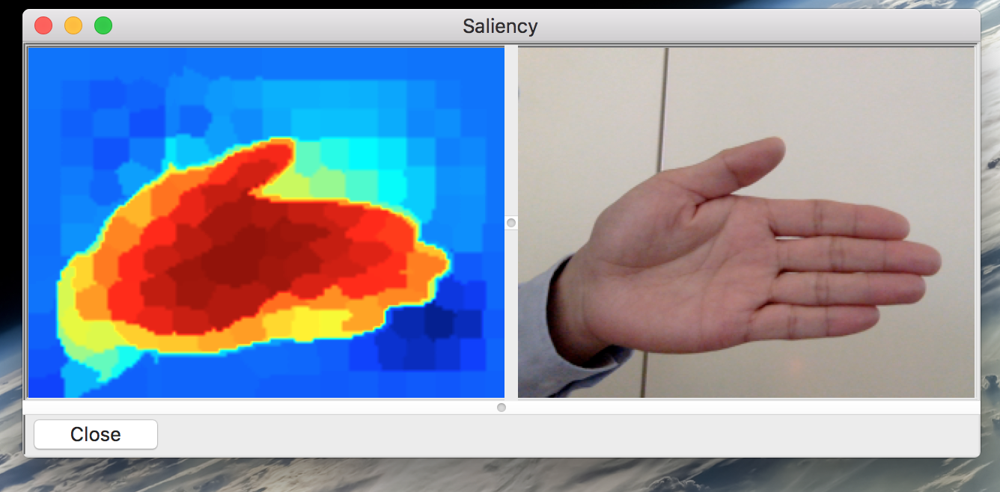

This program is a python implementation of our CVPR 2013 paper: "Saliency Detection via Graph-Based Manifold Ranking". For c++ implementation, please go check Chuan's github page at https://github.com/yangchuancv/ranking_saliency

You are welcome to download the code and use it in your own research or project. If you publish your work please cite my github URL and our paper: 

	@inproceedings{yang2013saliency,
	title={Saliency detection via graph-based manifold ranking},
	author={Yang, Chuan and Zhang, Lihe and Lu, Huchuan, Ruan, Xiang and Yang, Ming-Hsuan},
	booktitle={Computer Vision and Pattern Recognition (CVPR), 2013 IEEE Conference on},
	pages={3166--3173},
	year={2013},
	organization={IEEE}
	}
	
The program is tested on both Linux ( debian Jessie) and Mac OS ( El Capitan 10.11 ). If you are using cygwin under windows, it should also be no problem to run the code ( I don't have Windows, so it is just my guess :-) ).

# Dependencies  #

  * Python > 2.7
  * wxPython
  * opencv > 2.4
  * numpy
  * scipy
  * skimage
  * matplotlib
  
The code is not very sensitive to version of libraries used ( I think, :-)), so just install the dependencies simply by general package managers of your OS (aptitude brew, or pip in a python way). 
  
  
# Usage #

  * MR.py
  There are two classes you can use. One is MR_saliency which is the implementation of manifold ranking saliency. Simply

        import MR
		mr = MR() # initialization
		sal = mr.saliency(img)
		
  I leave all the parameters open to manipulating, you can set your own parameters during initializing the class. However, you don't have to do it, default values work pretty well, unless you really know what you want to do.[^1]
  
  Another class is a helper class help to show some calculation results such as superpixels, boundary priors and so on. It is very easy to understand the functionality, go check the source code

  * live_demo.py
  
  This is simple live demo showing how to use MR saliency. It is a real time saliency detection application by using webcam[^2]
  
  

# Bug Report and License #

 If you find any bug, feel free to report it on github or just throw me an email. 

 **Please Note** This program is released under GPL2.0, however, manifold ranking algorithm itself have been patented by OMRON co., Japan, my employer, so please don't use it in any commercial product. 

# Other Resources #

  * Please also check our saliency detection dataset DUT-OMRON at <http://saliencydetection.net/dut-omron>
  * If you are interested in me ( I guess you are not, :-), go check my homepage at <http://ruanxiang.net>
		
	

[^1]: check paper for details of the parameters

[^2]: the program use device ID 0 as input, you can modify device id to your own device
